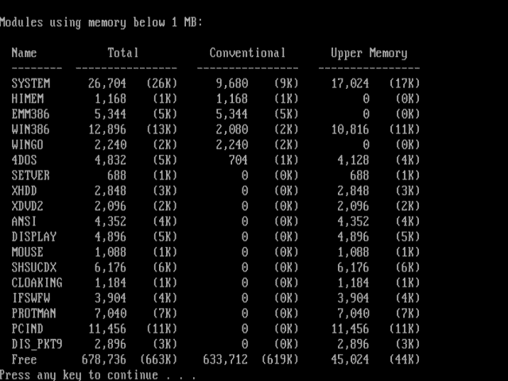
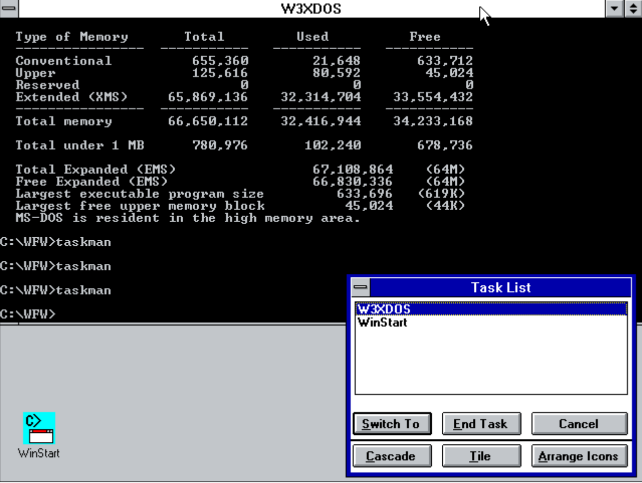

# WFWG Loaded by IO.SYS

It is well known that Windows ME let IO.SYS directly load VMM32.VXD, without using COMMAND.COM, without processing CONFIG.SYS and AUTOEXEC.BAT, and without calling WIN.COM. This is also why a number of patches have been released to activate the MS-DOS 8.0 Real mode, which is buried inside Windows ME. 

Another interesting question is: is it possible to configure other versions of Windows to run in a mode like Windows ME, particularly, without loading WIN.COM and any kind of dos command shell before loading Windows. The answer is, Yes. Below is a screen shot, which I have just snapped from my 86Box running MS-DOS 7.1 and Windows for Workgroups 3.11. Please note that in this user's DOS session, the usually exist WIN and the second command shell disappeared. Although a bit tricky, even WFWG311 can be configured in this directly loading mode. Here, direct loading does not mean ignoring CONFIG.SYS, but mean loading without running WIN.COM or a dos command shell first. Obviously, without a dos command shell, the AUTOEXEC.BAT is not processed. The dos kernel IO.SYS has the ability to load the WIN386.EXE of WFWG311 directly after processing CONFIG.SYS.

Besides that, if you are familiar with the limitation of WFWG, you should find the second screenshot more interesting. 4DOS.COM is being used as the WFWG windows shell under the title W3XDOS, which is not possible if you just set that in the SYSTEM.INI. Although this is a common practice in Windows 9x/ME, it is not allowed in WFWG. WFWG requires the windows shell to be a NE/PE executable. Either COMMAND.COM or 4DOS.COM is not a NE/PE executable. For the second screenshot, the WinGO/WinStart did helped. But, they are not the key to achieve this.

Tech details will be released in future.

 

A further text capture of the **mem.exe** output is as fellows:

```
Modules using memory below 1 MB:

  Name           Total           Conventional       Upper Memory
  --------  ----------------   ----------------   ----------------
  SYSTEM      26,976   (26K)      9,744   (10K)     17,232   (17K)
  HIMEM        1,168    (1K)      1,168    (1K)          0    (0K)
  EMM386       2,384    (2K)      2,384    (2K)          0    (0K)
  WIN386      15,312   (15K)      3,120    (3K)     12,192   (12K)
  4DOS         6,384    (6K)        752    (1K)      5,632    (6K)
  WINGO        2,288    (2K)          0    (0K)      2,288    (2K)
  MOUSE        1,088    (1K)          0    (0K)      1,088    (1K)
  MousClip     2,784    (3K)          0    (0K)      2,784    (3K)
  CLOAKING     1,152    (1K)          0    (0K)      1,152    (1K)
  SETVER         624    (1K)          0    (0K)        624    (1K)
  XHDD         2,816    (3K)          0    (0K)      2,816    (3K)
  XDVD2        2,064    (2K)          0    (0K)      2,064    (2K)
  ANSI         4,320    (4K)          0    (0K)      4,320    (4K)
  DISPLAY      4,864    (5K)          0    (0K)      4,864    (5K)
  IFSWFW       3,872    (4K)          0    (0K)      3,872    (4K)
  SHSUCDX      6,240    (6K)          0    (0K)      6,240    (6K)
  NLSFUNC      3,872    (4K)          0    (0K)      3,872    (4K)
  KEYB         7,440    (7K)          0    (0K)      7,440    (7K)
  PERUSE       4,112    (4K)          0    (0K)      4,112    (4K)
  DOSKEY       4,688    (5K)          0    (0K)      4,688    (5K)
  DOSLFNMS    11,008   (11K)          0    (0K)     11,008   (11K)
  KSTACK       1,520    (1K)          0    (0K)      1,520    (1K)
  Free       665,344  (650K)    637,712  (623K)     27,632   (27K)

Memory Summary:

  Type of Memory       Total         Used          Free
  ----------------  -----------   -----------   -----------
  Conventional          655,360        17,648       637,712
  Upper                 127,440        99,808        27,632
  Reserved                    0             0             0
  Extended (XMS)     65,867,312    32,312,880    33,554,432
  ----------------  -----------   -----------   -----------
  Total memory       66,650,112    32,430,336    34,219,776

  Total under 1 MB      782,800       117,456       665,344

  Largest executable program size         637,696   (623K)
  Largest free upper memory block          15,552    (15K)
  MS-DOS is resident in the high memory area.
```
