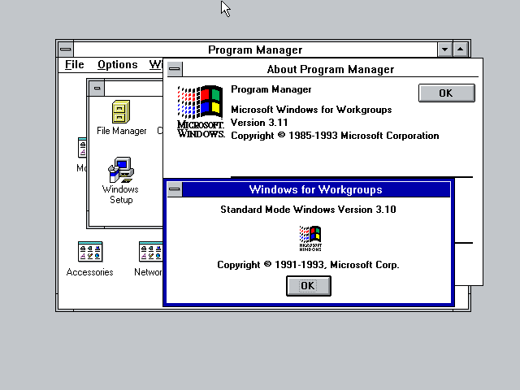
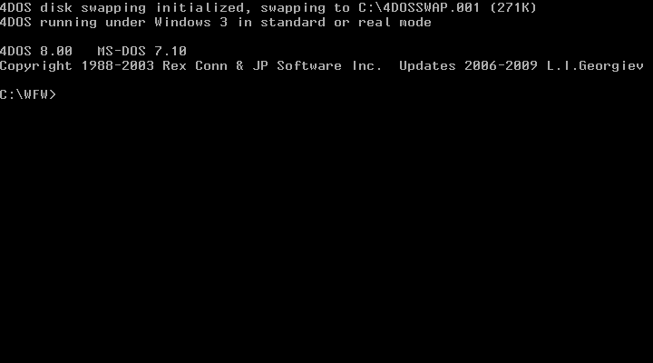
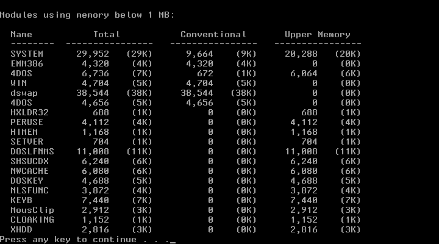

# WFWG Standard mode?
WFWG, or more precisely, **Windows For Workgroups 3.11** is a version of Windows that can not work in standard mode. According to [Wikipedia](https://en.wikipedia.org/wiki/Windows_3.1x#Windows_for_Workgroups_3.11 ), this is the first version of Windows that drops the standard mode (a.k.a. 286 mode). However, the standard mode is still there in fact, inside the WFWG. 

I came across an interesting thread on the [Google Groups](https://groups.google.com/g/comp.os.ms-windows.networking.windows/c/iHmJSleX_68), mentioning that there is a switch /d:T that will start the WFWG in standard mode.

More instructions come from the [DynaBook](https://support.dynabook.com/support/viewContentDetail?contentId=108270 ) site, stating that the switch /d:T will make WFWG to work in a trouble shooting mode. This mode seems like the Win9X's safe mode.

When I tried it on my 86Box, it works. Amazingly, in this mode, MS-DOS 7.1 kernel patch is not needed. The original version of IO.SYS from the Windows 98 SE can start WFWG in standard mode directly, exactly like what Windows ME's IO.SYS can do.

Under this mode, interesting things like following happen:



The Program Manager reports that it is running WFWG, while winver.exe tells you that it is Standard Mode Version 3.10.

To make this mode fully operable, some additional files must be copied from Windows 3.1 to the WFWG. These files include: **DSWAP.EXE**, **VGACOLOR.2GR**, **VGAMONO.2GR**, **WINOLDAP.MOD**, **KRNL286.EXE**. These files should be put in the **SYSTEM** directory in the WFWG installation directory. An additional setting must be put in the **SYSTEM.INI** **[boot]** section. 

```
286grabber=vgacolor.2gr
```

Under this mode, 4DOS detects that Windows 3 running in Standard mode, as follows:



There is no 386 mode task switching, only Alt+TAB switching is allowed. Alt+Enter is not working. Command prompt can not be run in window mode, only full screen. In the user DOS session, DSWAP is there, while win386 not.


 
The conclusion is: WFWG can be configured to run in standard mode. This mode is the safe mode of WFWG. It can be started using command: 

```
WIN /D:T
```
